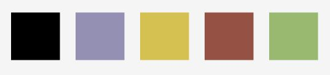

# Disney Villains Quiz

This quiz is built for all Disney Villains fans to answer questions about the villains of Disney universe. The quiz go through 10 of the most famous Disney classics villains. For each question answered correctly the user will receive 10 points. 

# Live Project

[View live project here](https://tatianaruffo.github.io/disneyvillains-quiz/)

## Contents

---

- [User Experience](#ux)
  - [User Stories](#user-stories)
  - [Site Owner Goals](#goals)
- [Design](#design)
  - [Colour Palette](#colour-palette)
  - [Fonts](#fonts)
  - [Images](#images)
- [Prototype](#prototype)
- [Features](#features)
    - [Landing Page](#landingpage)
    - [Instructions](#instructions)
    - [Game Page](#game)
- [Technologies](#technologies)
- [Testing](#testing)
- [Deployment](#deployment)
- [References & Credit](#references-credit)

## User Experience
---

### User Stories

- As a user, I want to understand what the game is about.
- As a user, I want to easily navigate through the game even on the first visit.
- As a user, I want to access the game easily.
- As a user, I want to be able to see my final result.
- As a user, I want to be able to see my progress during the game.

### Site Owner Goals

- As a site owner, I want to build an appealing online quiz.
- As a site owner, I want to build a quiz which is easy to navigate.
- As a site owner, I want to build a quiz which is fun for the user and keeps users attention.

## Design

---

### Colour Palette

**Main Colour Palette** 

The color palette was chosen from a classic image of the Disney Villains. The main colors are black and purple. For the game the yellow becomes also a main color. The green and red colors used to indicate correct and incorrect questions are also taken from the image.

### Fonts

**Heading:** For Heading and most of the main text I used "Metal Mania".

**Body:** "Roboto" This font is simple, modern open and easy to read. 

[_Sourced via Google Fonts._](https://fonts.google.com/)

### Images

[_Sourced via Pinterest._](https://www.pinterest.ie/) 

- The site has only one image

- Image taken for color palette has the same source

## Prototype

Prototype was created using [Figma](https://www.figma.com/)
---
Deviations from the original prototype:
* The photo dimensions didn't work for the quiz page so I chose to stay with a black background.

[Index](assets/readme/desktop.JPG)
[Quiz](assets/readme/quiz-desktop.JPG)

## Features

---

### Landing page

- Intuitive navigation and orientation on the website.
- Easy access to start the game.

* The user is greeted with a hero image of some of the classic Disney Villains and a easy to spot button to start the game together with a button for instructions. 

### Instructions

### Game Page

* The user is redirected to a page where he can choose to start the game clicking the "start" button

* The user can see at the top the progress of the game 1/10 and the current score. The user have a feedback when a answer has been selected, indicating whether the answer was correct or incorrect, correct answer goes green and the rest goes red. For each correct answer the user receives 10 points which are added up in the score counter. 

## Technologies

---

### Languages

- [HTML5](https://en.wikipedia.org/wiki/HTML5)
- [CSS3](https://en.wikipedia.org/wiki/CSS)
- [JavaScript](https://www.javascript.com/)

### Other

- [Google Fonts](https://fonts.google.com/) - Fonts
- [Tiny PNG](https://tinypng.com/) - Compress Images
- [Github](https://github.com/) - Storing and hosting repository
- [Gitpod](https://www.gitpod.io/) - Code editor
- [Chrome DevTools](https://developers.google.com/web/tools/chrome-devtools)
- [Figma](https://www.figma.com/)

## Testing

## Responsiveness

All pages were tested to ensure responsiveness on screen sizes from 400px and upwards on Chrome, Edge and Firefox.

Steps to test:

1. Open browser and navigate to [Disney Villains - Landing Page](https://tatianaruffo.github.io/disneyvillains-quiz/)
2. Open the developer tools (right click and inspect)
3. Set to responsive and decrease width to 400px
4. Set the zoom to 50%
5. Click and drag the responsive window to maximum width

Expected:

Website is responsive on all screen sizes.
No horizontal scroll is present.
No elements overlap.

Actual:

Website behaved as expected 

## Functional Testing

**Navigation Links**

Testing was performed to ensure all navigation links on the respective pages, navigated to the correct pages as per design. This was done by clicking on the navigation links on each page.

| Navigation Link | Page to Load            |
| --------------- | ---------------         |
| Start Quiz      | game.html               |
| Instructions    | index.html#instructions |
| Start at game   | Initiate the game       |
| Next            | Jump to next question   |
| Back to main    | index.html

Links on all pages navigated to the correct pages as exptected.

**Game testing**

Testing was performed on the game to ensure behaviour was as expected.

Expected:

After the user clicks their answer, right answer goes green and the rest goes red and the score is incremented.

Actual:

Buttons behaved as expected.

## Lighthouse Testing

### Desktop

## Deployment

---

This project was created through [GitHub](https://github.com/):

1. Locating repository, clicking on the "New" button.
2. Selecting the relevant template: "Code-Institute-Org/gitpod-full-template"
3. Adding the repository name "innski".
4. Clicking the button "Create repository".

This project was developed using [GitPod](https://gitpod.io/) and committed and pushed to GitHub using the GitPod terminal. Following "git commands" were used:

1. **git add .** - This command for multiple files to the staging area before commiting.
2. **git commit -m "Message explaining upadate"** - This command explained changes that were done to the repository.
3. **git push** - This command was used to push all committed changes to the GitHub Repository.

This project was deployed from its Github repository to Github Pages:

1. Log in to Github account
2. From the projects repository selecting "Settings" tab.
3. Click on "Pages" from the left-hand menu
4. The "Source" box must state "Deplay from branch"
5. Under "Branch", click the dropdown named "None" and select "main".
6. Click save.
7. After a few seconds, refresh the page and retrieve the link.

## <a name="#references-credit">References & Credit</a>

---

### Media & Fonts

- [tiny.png](https://tinypng.com/): Used to compress media files
- [Kind Png](https://www.kindpng.com/) & [Harry Potter Fandom](https://harrypotter.fandom.com/): Resources for images
- [Archive](https://archive.org/details/HarryPotter-hedwigTheme): Resource for Harry Potter Theme Audio
- [Font Awesome](https://fontawesome.com/): Resource for icons
- [Google Fonts](https://fonts.google.com): Used as font library
- [CDN Fonts](https://www.cdnfonts.com/): Used as font library
- [Remove](https://www.remove.bg/de): Used to create a transparent PNG
- [MP3 Cut](https://mp3cut.net/de/): Used to cut audio file
- [RealFaviconGenerator](https://realfavicongenerator.net/): Used to create a Favicon

### Code

- [W3Schools](https://www.w3schools.com/) & [MDN](https://developer.mozilla.org/): General source of help and guidance throughout this project.
- [W3Schools](https://www.w3schools.com/howto/howto_js_sidenav.asp): Guidance on creating a side navigation.
- [Nguyễn Quyết](https://betterprogramming.pub/rewrite-your-own-array-methods-foreach-map-filter-find-reduce-1718e1138c3e): Guidance for Array Methods.
- [freeCodeCamp](https://www.freecodecamp.org/news/javascript-settimeout-how-to-set-a-timer-in-javascript-or-sleep-for-n-seconds/): Guidance on setting a Timeout with JavaScript.
- [Benjamin Knight](https://codepen.io/benknight/pen/BywEpw): Guidance on styling a Progressbar. 
- [CSS {In Real Life }](https://css-irl.info/drop-shadow-the-underrated-css-filter/): Guidance for drop shadow.

### Content

All the questions provided in the game were taken from [Beano](https://www.beano.com/posts/the-ultimate-hufflepuff-quiz)